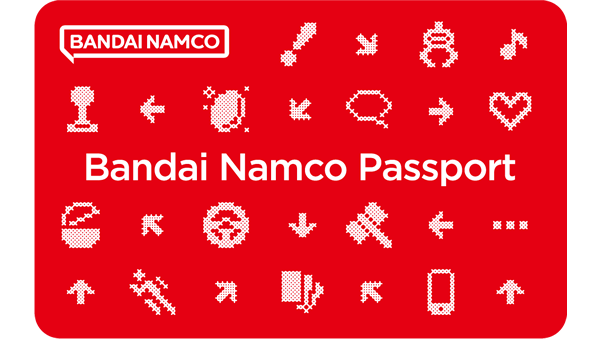
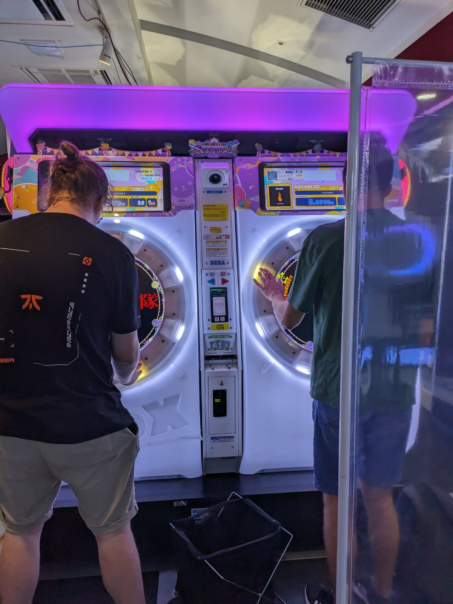
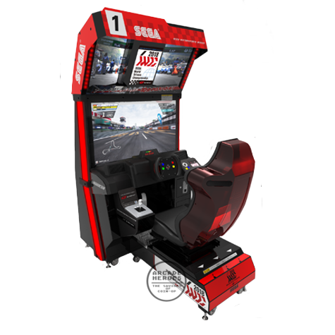
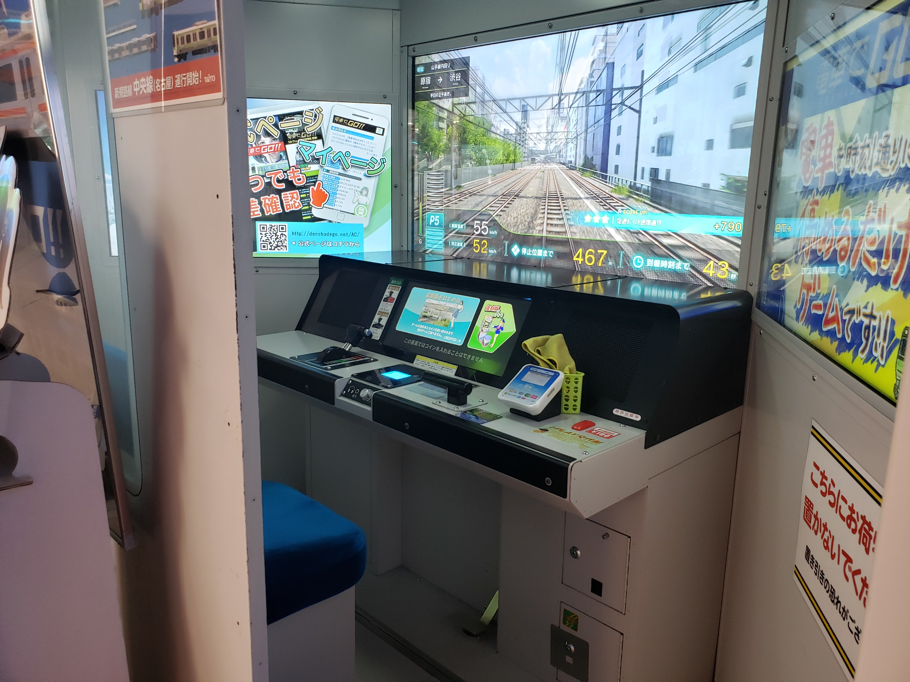
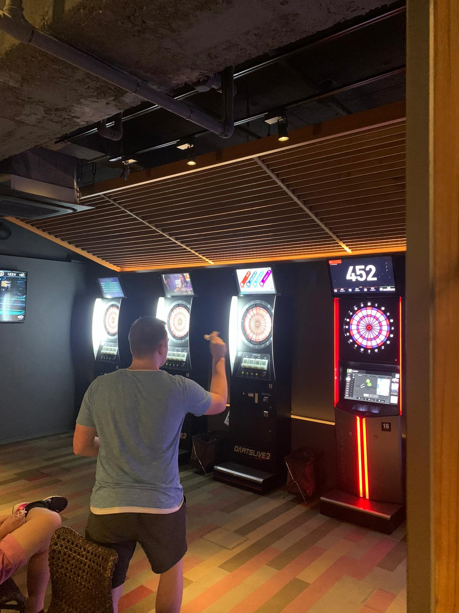
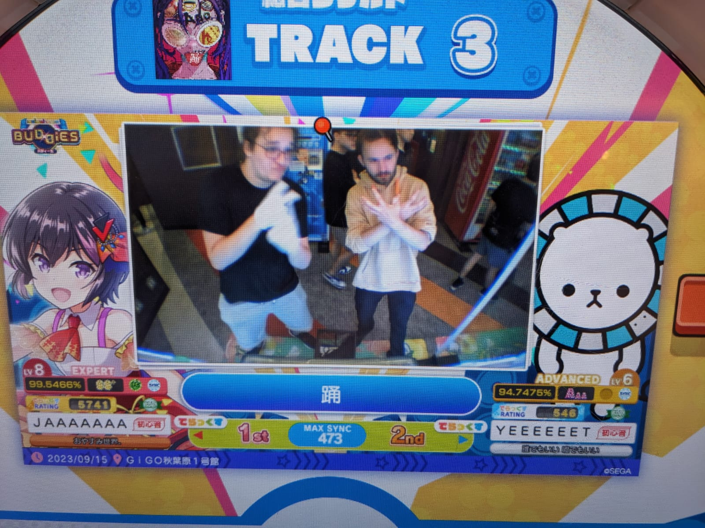
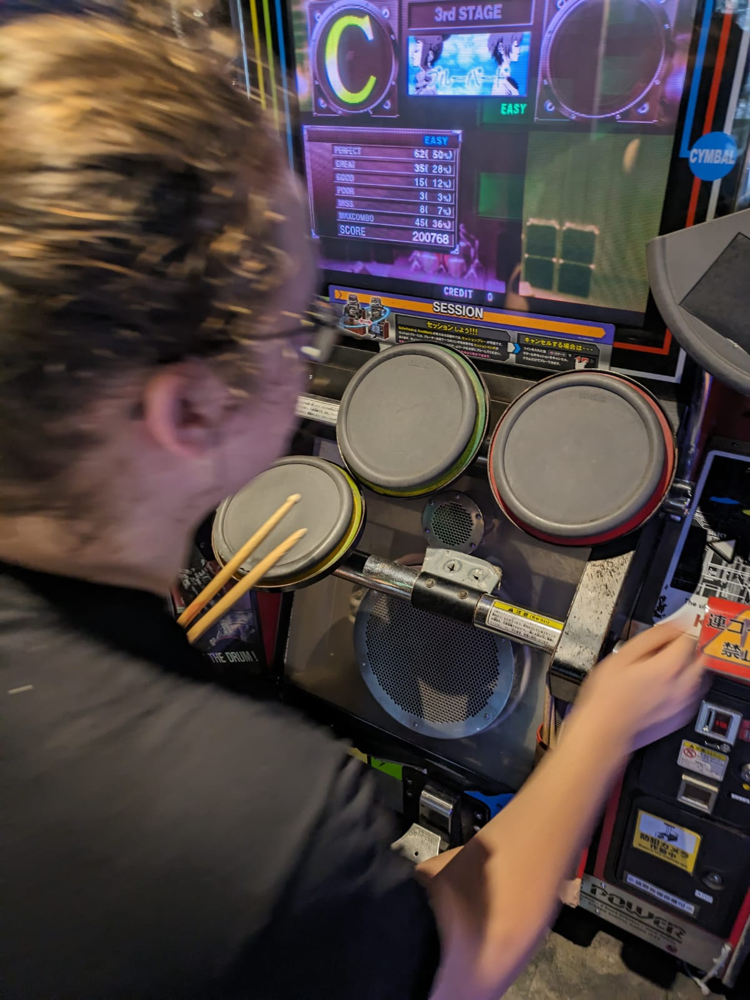

# Arcades
Bevor wir in Japan waren, dachte ich, dass ich Arcades gar nicht feiern würde. Am Ende waren wir jeden einzelnen Tag in einem. Vor allem Lukas und ich waren die Mai Mai Don's und zeigen bis heute akkute Entzugserfahrungen. Generell gibt es 3 Arten von Arcades: Moderne (oft ketten), Pachinko und Retro-Arcades. Die beiden Ketten, die man in jedem Stadtteil findet, sind GiGo und Taito Game Stations. Da findet man immer dieselbe Auswahl an beliebten Arcade Games. In retros findet man oft so geile alte Schinken, ganz andere Vibes aber beide sehr feierlich. Pachinkos sind basically japanische Spielos, wo man so fake skill mäßig gamblen kann. Waren wir nie drin, verpasst man aber auch nichts.

## Generelles
Generell, wie bei fast allem in Japan, gibt es immer mehrere Etagen, wo jede so ’ne Art Theme hat. Rhythm Games, Racing Games, Fighting Games, Crane Games, Photobooths, etc. Die meisten lassen sich entweder mit Münzen oder auch mit Suica Cards bedienen. Auf jeder Etage gibt's auch immer ’n Münzautomaten, der Scheine in 100-Yen-Münzen macht, was meistens einer Runde (5–15 Min. je nach Game) entspricht. Lukas und ich waren die absoluten Rhythm Game Freaks, Manu war eher Racing Main. In Retro-Arcades hast du auch noch so richtig geile 64-Bit Geschichten. Generelle Etikette ist: Wenn jemand an einer Maschine ist, stellt man sich an, spielt eine Runde und stellt sich dann wieder an. Lukas und ich hatten natürlich die guten Spots gefunden, wo man oftmals mehrere Runden am Stück spielen kann, weil nicht so viele Goons unterwegs sind. Bevor du das erste Mal gehst (egal, wie skeptisch du bist), hol dir einen Bandai Namco Pass. Die Dinge kannst du vor jeder Session an den Automaten einscannen und kannst so progress tracken. Ein absolutes Muss und ist irgendwie weniger als ’n 5er.

Es ist auch immer empfehlenswert, die sogenannten Don's zu beobachten. Wenn man ein paar Mal da war, kann man direkt erkennen, wer hier nur zum Spaß ist und wer hier ist, um ein modernes Meisterwerk einer Arcade-Performance hinzulegen. Und dann gilt es natürlich: beobachten, lernen, und in der Warteschlange nach Tipps und Tricks mit gebrochenen Japenglisch zu fragen. Ein wahrer Meister ist ein ewiger Schüler und denk dran, man kann immer etwas von den Arcade Don's lernen.

## Mai Mai

Der unangefochtene King aller Arcade und Rhythm Games. Diese magische Maschine hat mich und Lukas mehrere Dutzend 100-Yen-Münzen gekostet und ich habe keine einzige davon bereut. "Eine Runde Kreis" ist mittlerweile ein fest gebrannter Insider und als Lukas einmal in Kleve zu Besuch war, sind wir 2 Stunden nach Holland zu 'nem kleinen Arcade mit Mai Mai Maschine gefahren, um die Sucht ein bisschen zu stillen. Man wählt bei dem Ding irgendeinen J-Pop oder Vocaloid Song aus und muss rechtzeitig Knöpfe und Noten auf 'nem Screen timen. Die Lernkurve ist extrem steil und belohnend. Auch hier haben Lukas und ich viel von den Don's gelernt: es gibt einen AUX plug, also verkabelte Kopfhörer sind OP, da die Arcades manchmal so laut sind und die Maschienen so leise das man nichts hört. Außerdem: Wahre Don's kaufen sich so Baumwollhandschuhe für optimales Gleiten über den Bildschirm bei Slidern. Man kriegt so ’n paar bei Daiso oder Donqi (1 € Läden). Die Mai-Mai-Lore geht noch viel deeper, special Events, druckbare Karten, Booster, etc., aber den Weg musst du selbst beschreiten und dich von den lokalen Don's leiten lassen. Ich fordere MINDESTENS 1 Beweisvideo, um deine Skills zu beurteilen.

## Racing Games
Wie gesagt, das war eher Manu's Domäne, aber muss man safe einmal gezockt haben. Es gibt n paar die sind recht Basic, zum Beispiel Mario Kart wo du halt gaspedal und Lenkrad hast, es gibt aber auch so geile Dinger wo du auf Zeit ne Piste runter bretterst und dann teilweise auch Schalten kannst. Da findest du auch eine ganz andere Art von Don's. Was man da teilweise sieht, ist wirklich Peak Male Performance.

## Das Fritz Special
Eine Maschine, die ich nie gespielt habe, die aber recht legendär ist, ist die Densha de Go! Deine einmalige Chance deinen Status als Zug Freak zu festigen.

## Bagus
Kind of ein Arcade, aber auch nicht wirklich. Bagus ist so fancy Bar-Vibe und hat dann Dartscheiben und Billardtische. Wir waren gaube ich 3 Mal da. Klingt erstmal nicht so krass, aber diese Dartscheiben sind so krass und es macht schon echt Bock. Die haben so Gamemodes, z. B. je mittiger desto mehr Punkte, was nice ist, weil eh niemand in der Lage ist, 20's zu hitten. Und die haben auch so krasse Cams, Replays, Animationen und Geschwindigkeitsmesser. Einfach Darts, aber in Ultra-Fun.

## Bilder

