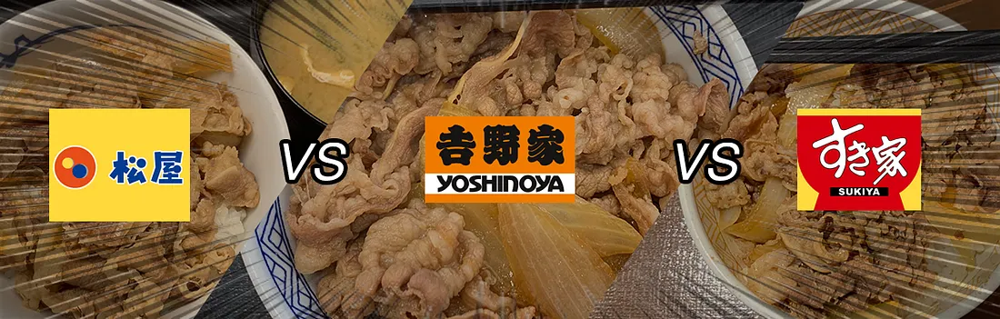
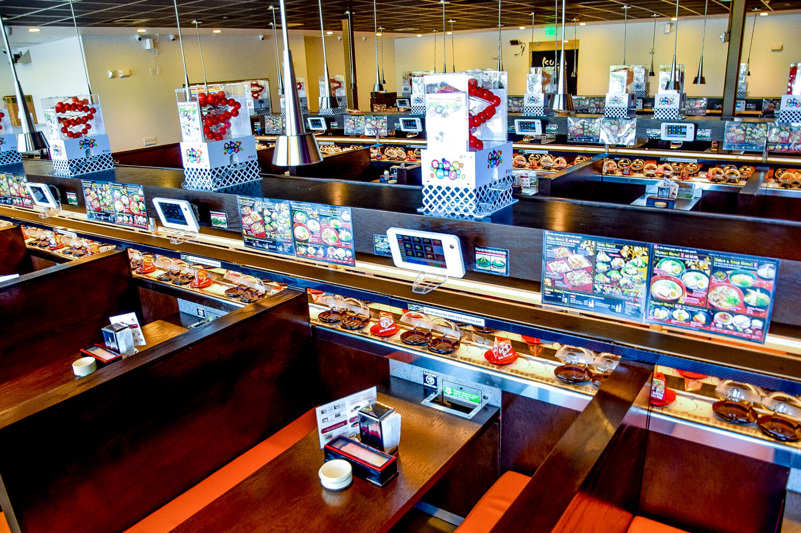
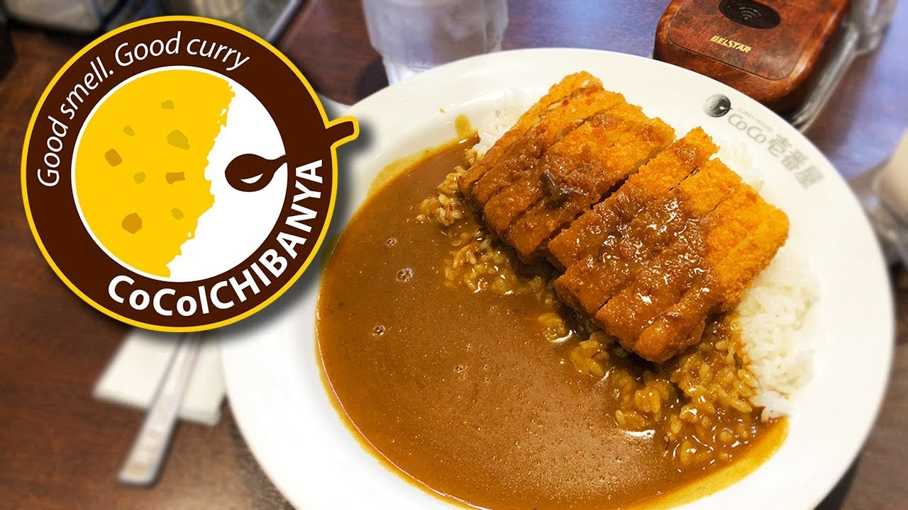
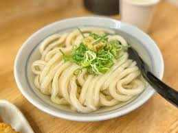
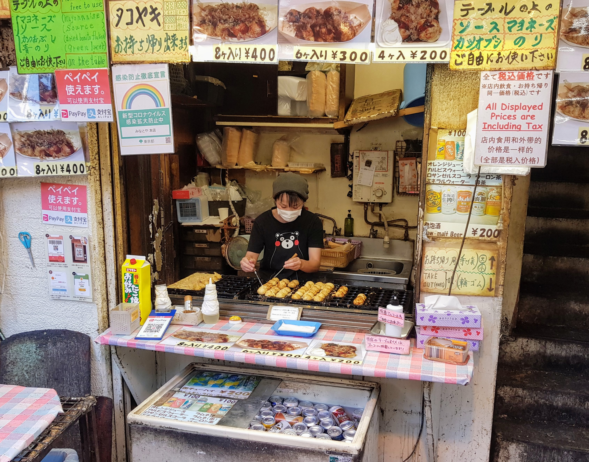

# Food
Jeder weiß, dass Japan ein absolutes Paradies, was Essen angeht. Ich glaube, es ist fair zu sagen, dass man selten woanders so günstiges und leckeres Essen findet. Kochen ist hier wirklich vollkommen überflüssig, weil man wahrscheinlich selber gar nicht günstiger kochen kann. Die Restaurant Experience in Japan ist auch einfach crazy, selbst im MC'es. Immer gratis Wasser, extremst hilfreiches und freundliches Personal und halt baba Essen.

## Wie man gutes Essen findet 101
In Japan gibt es in Restaurants oft nur eine Sache auf der Karte. Du gehst nicht in ein Restaurant, du gehst in einen Sushi-Laden, einen Gyudon-Laden, einen Ramen-Laden, einen Soba-Laden … Das Gericht gibt's dann immer in 20 verschiedenen Versionen und Varianten, aber du kannst dir sicher sein, die können kochen, was sie anbieten, und zwar Hallo!

Gibt es eine Schlange vor dem Laden? Dann lohnt es sich wahrscheinlich zu warten. Reservieren ist nicht in Japan und alles, was geil ist und gut läuft, hat Schlangen vorm Laden zu Stoßzeiten. Man kennt’s ja auch von Takumi Düsseldorf. Die Schlangen bewegen sich aber oft sehr schnell und man wartet nicht sonderlich lange. Oft lohnt es sich also zu warten, oder man merkt sich den Laden und kommt später wieder, wenn's nicht so busy ist.

Wenn's wer weiß, dann die Office Worker. Gerade um Mittag rum suchen sich die Office-Atzen ihr Mittagessen, oft in sogenannten "Teishokus" (Essenshäuser). Da findet man meist "schnelles, einfaches und günstiges" Essen, aber teilweise die göttlichsten Mahlzeiten, die wir hatten. Die sind auch oft die wenigen Ausnahmen, wo du mehr als nur ein Menüitem hast. Eines meiner Lieblingsgerichte war ein Gyoza Meal Set in irgendeinem random Schuppen. Gänsehaut.

Je schwieriger es ist den Laden zu finden desto besser wird er sein. Große Läden die auf Englisch oder mit großen Reklamen werben sind den Hinterecken Holzhütten die von irgendwelchen 80 jährigen Omi's und Opi's betrieben werden um Meilen unterlegen. Je nieschiger und versteckter, desto besser. 

Google Maps Pro Tip: Wenn ihr nach Restaurants sucht, zum Beispiel einem Ramen-Restaurant, sucht auf Google Maps mit den japanischen Schriftzeichen (z.B. ラーメン), da viele Läden (vor allem die Alten und Traditionellen) mit Romanji nicht aufgeführt werden. Die Japaner sind auch oft härter, was Bewertungen angeht. In Japan sind 3 Sterne ein gutes Rating, und alles über ner 4 wird fast garantiert scheppern.

## Gyudon: Die Big Three
Unser Go-to für eine schnelle, günstige und absolut köstliche Mahlzeit war immer Gyudon-Restaurants. Übersetzt heißt Gyu Fleisch und Don Reis, diese Läden verkaufen also hauptsächlich Reisschüsseln mit Fleisch. Der Klassiker ist dünnes Rindfleisch, gekocht mit Zwiebeln, in einer Dashi-Sojasaucenbrühe und dann einfach über den Reis gekippt. Empfehlenswert sind sonst noch Oyakodon (Hühnchen und Ei) und die Seasonal Items. Ich bin gar nicht mehr sicher, was es genau war, aber die eine Limited-Time-Schüssel, die es da gab, habe ich ultra durchgespammt. Auch empfehlenswert: Oft gibt es als Toping einfach n rohes Eigelb. Absolut köstlich.
Diese Gyudon-Restaurants findest du zwar an sich überall, aber es gibt 3 Ketten, die du quasi immer in einer 100-Meter-Reichweite von dir auffinden kannst, egal wo du bist: Yoshinoya, Matsuya und Sukiya.

Ich und die Bois sind überzeugte Yoshinoya-Ultras, aber alle 3 lassen sich gut sehen. Ich glaube, ich lüge nicht, wenn ich sage, wir haben mehr als die Hälfte unserer Mittags-Zwischenmahlzeiten in einer dieser Establishments eingenommen. Wie so oft, sind diese Läden auch einfach von Anfang bis Ende durch optimiert. Du setzt dich, hast ein Tablet zum bestellen, kannst Größe, Schärfe, Menüs, etc. frei kombineren und innerhalb von 1 Minute steht die Schüssel auf deinem Tisch. Am Ende gehst du glücklich wieder raus und zahlst je nach Hunger zwischen 2-5€. Wir sind meistens für das Mealset gegangen - große Reisschüssel, Misosüppchen und was Salatiges (ich hatte immer Kimchi) - 3€ und ’n paar Krumme.

## Die anderen Ketten
Neben den Gyudon-Ketten gibt es noch 2 weitere ikonische Ketten, die man mindestens einmal ausprobiert haben muss. Kura Sushi und CoCo's Curry House. Bei Kura Sushi kriegst du so ’nen 4er-Tisch an einem von diesen klassischen Conveyor Belts, kannst dir qualitativ wirklich gutes Sushi bis zum Geht-Nicht-Mehr-Rein-Knallen und am Ende haben wir nie mehr als 15 Tacken da gelassen. Absolut worth it.

Die andere Kette, die ein wirkliches Muss ist, ist CoCo's. Wir waren glaube ich 3 oder 4 mal da und es ist wirklich lächerlich köstlich. Die gibt's auch eigentlich in jedem Stadtteil (teilweise mehrfach) und du kriegst köstliches japanisches Curry. Unser Favorit ist das Menü mit Katsu (Schnitzel) und ich glaube, ich hab noch nie so ein köstliches und zartes Schnitzel gehabt. CoCo's ist bei einigen von den Bois der absolute Lieblingsladen gewesen und auch bei mir sehr hoch gerated. 4

## Jakob's Favourites

- [Sanuki Udon Jinza](https://maps.app.goo.gl/4bAE3MeeRrwZZRwVA) - Mein Lieblingsrestaurant aus der ganzen Zeit. War anfangs skeptisch, ob ich Udon fühlen würde, aber heiliger Bimmbamm, der Laden scheppert. Ich hatte sie damals kalt, weil wir 30° hatten, aber warm ist bestimmt auch göttlich. Ich weiß bis heute nicht, was in der Brühe ist, aber die Kombination aus der leichten, aromatischen Brühe, mit den wunderbaren Nudeln, die eine Mischung aus wabbelig und bissig sind, ist mir bis heute nicht aus dem Kopf gegangen. Hinweis: Der Laden macht nur Mittagsgeschäft und es wird eine kurze Schlange geben. Bestellt habe ich die Ultra Basic Variante mit Brühe, Nudeln und Frühlingszwiebeln. Mehr braucht es nicht.

- [Minatoya](https://maps.app.goo.gl/CsmHBXTBPaNse5px5) - Würde dieser Stand eine europäische Lebensmittelsicherheitsbehörde überleben? Garantiert nein. Ist das leicht angeschmolzene Styropor von den heißen Takoyaki etwas besorgniserregend? Vielleicht. Lohnt es sich trotzdem und ich würde jeden Tag dort essen, wenn ich könnte? Garantiert. Takoyaki sind absolut King und dieser ranzige Stand entlang des Ueno Street Markets hat mich am heftigsten weggescheppert. Uneo ist eine Station von Akihabara (Weeb-Mekka) entfernt (ca. 20 Min.) und entlang der Strecke gibt es viele kleine Läden, Händler, Restaurants und Stände. Sehr empfehlenswert, und wenn ihr hier seid, unbedingt die Takoyaki probieren.

- [Asakusa Kagetsudō Melon Bread](https://maps.app.goo.gl/i8tfetQPZ5hX3ZdL7) - Melon Pan vom Konbini kann man sich easy jeden Tag fetzen, aber einmal muss man sich auch eins der Extraklasse gönnen. Wenn ihr in Asakusa (traditionelles Viertel) unterwegs seid, solltet ihr hier an diesem Melon Pan Stand ne kleine Pause einlegen. Es gibt die Dinge "pur" oder mit Eis. Wir fanden die mit Eis kinda meh, einfach lieber 2 von den Normalen.

- [Katsudon-ya Zuicho](https://maps.app.goo.gl/ufJweCVSv1MUvP6K9) - Katsu ist basically japanisches Schnitzel. Serviert kriegst du das Ganze hier mit Ei, Reis und nem kriminellen Sößchen. Hier mussten wir auch ein bisschen warten aber es hat sich gelohnt für das buttigst weicheste Fleisch das ich je hatte.

- [Royal Host](https://maps.app.goo.gl/mCrd9RognnxxAMHx6) - Hier kriegst du auch mehrere Leckereien. Wir waren riesige Fans vom Omurice aber auch das Hambagu hat hier anders reingefetzt. Die haben mehrere Locations, und wenn du ein paar moderne japanische Klassiker probieren willst, bist du hier gut aufgehoben.

## Generelle Liste

Bevor du Japan verlässt, solltest du diese Liste einmal abgearbeitet haben:
 - Gyoza - Japans Teigtaschen, einer meiner Lieblingsmahlzeiten
 - Ramen - Gibt's nicht viel zu zu sagen. Absoluter klassiker, es gibt tausende Restaurants und man wird nie enttäuscht sein.  
 - Soba - Nudeln aus Buchweizen. Gibt's als Süppchen oder in Dipping-Varianten. Meinung von den Bois war recht gespalten, ich feiers aber.
 - Udon - Und nochmal Nudeln. Udon sind sehr dicke Nudeln, schwer mit was anderem zu vergleichen.
 - Katsu - Ich weiß nicht, was die mit ihrem Fleisch machen, aber irgendwie sind Katsus immer so unfassbar weich und juicy, es ist echt frech.
 - Takoyaki - Kleine Teigbällchen mit einem Stück Oktopus in der Mitte und allen möglichen Toppings.
 - Sushi - Sollte selbsterklärend sein.
 - Unagi - Geräucherter Aal, der immer mit einer typischen kriminellen Soße kommt. Findet man häufig als Unagi-Don auf Reis, hier empfiehlt es sich besonders einen Laden zu suchen der sich auf Unagi spezialisiert. Das war Manus absoluter Favorit und er wollte uns immer überreden, nochmal Unagi zu essen.
 - Curry - Japanisches Curry hittet einfach anders. Klassisch mit Reis, Curry Udon, Katsu Curry, Curry Pan, die Optionen sind vielseitig und alle scheppern.
 - Omurice - Omelett mit gebratenem Reis und nem köstlichen Sößchen. Absolut oberköstlich.
 - Famichiki - Es ist schwierig, in Worte zu fassen, warum ein Stück Hühnchen aus einer Konbini-Auslage ein Muss ist, aber du wirst es verstehen, wenn du es probierst.
 - Okonomiyaki - Herzhafter Pfannkuchen mit Kohl. Muss man sich oft selbst grillen im Laden, macht aber echt bock und war Lars Favorit

