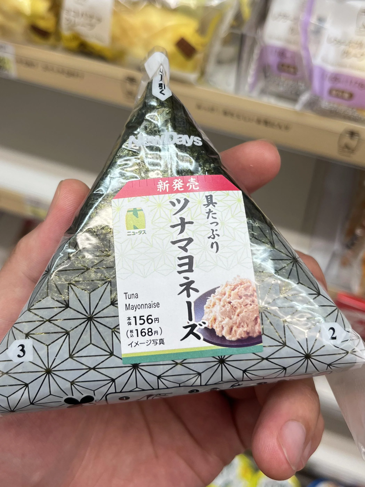
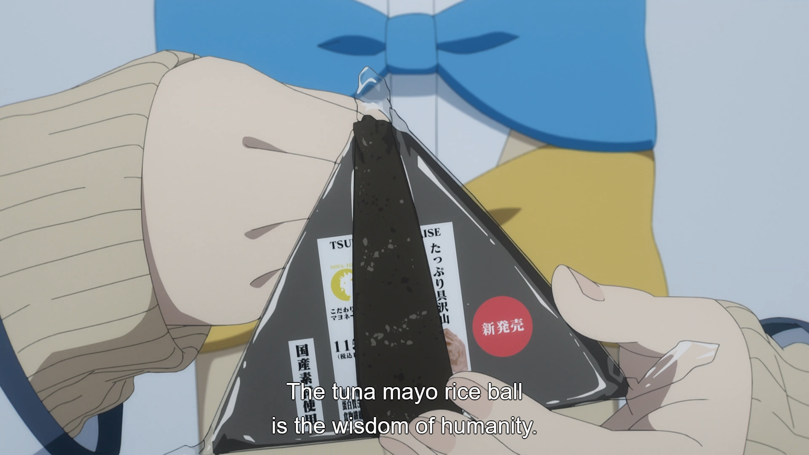
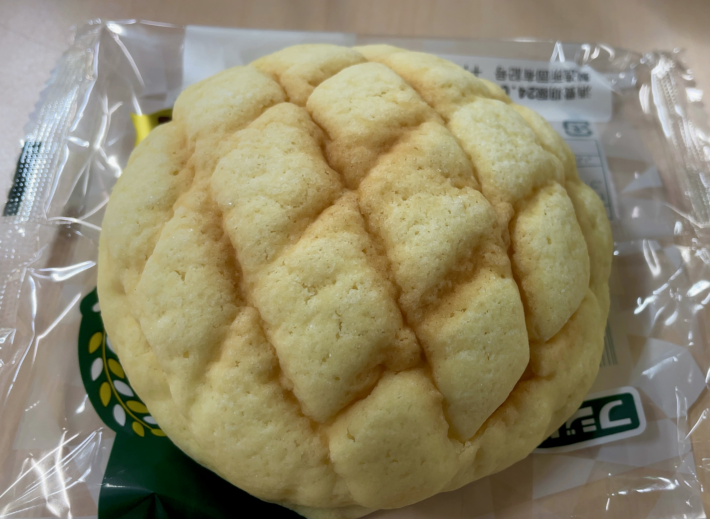
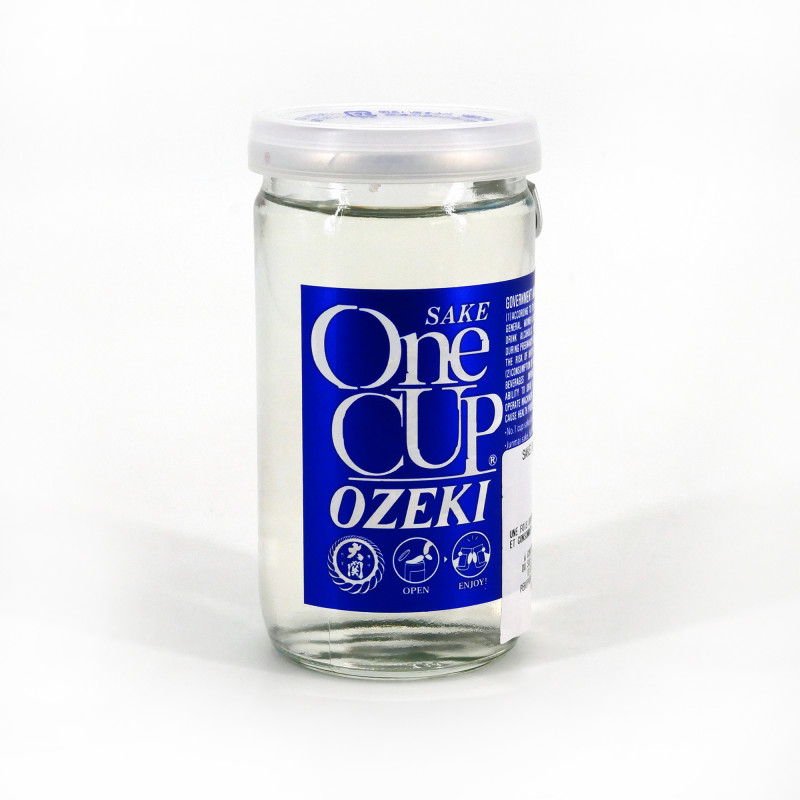
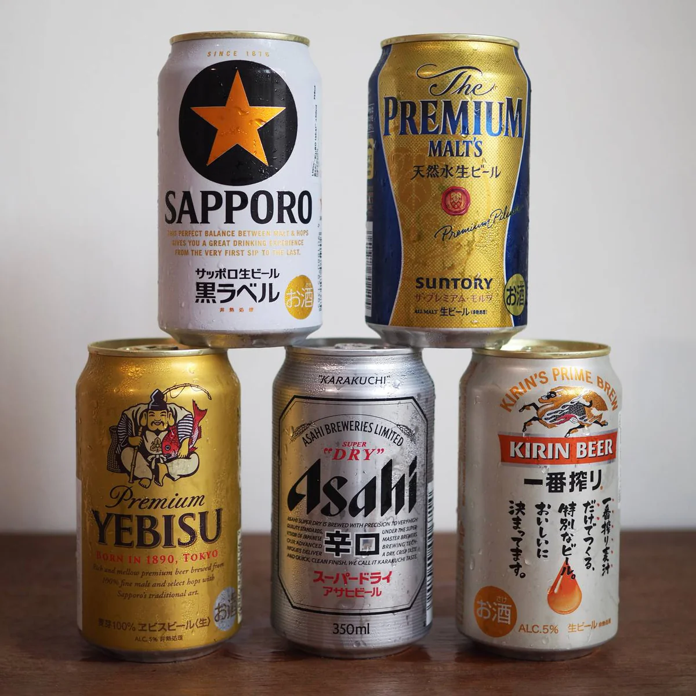

# Konbini Guide
Wenn man mich fragen würde, was die eine Sache ist, die die Japaner haben, die wir auch brauchen, dann sind es ganz klar Konbinis. 24/7 offen, extremst günstig, hat alles was man braucht und die haben verdamt leckere Sachen. Ich und die Bois haben jedes einzelne Frühstück und einige Snacks und Zwischenmahlzeiten hier gegessen und es gibt einfach nichts zu beklagen. Wie so oft in Japan gibt's mal wieder die Big 3: 7-Eleven, FamilyMart und Lawson. Die Bois sind 7-Eleven Ultras, aber ich find alle sind krank. Hier ein paar Sachen die du probieren musst:

## ONIGIRI
Tuna Mayo Onigiri könnte so nah an dem perfekten Essen sein, wie wir Menschen jemals sein werden. Zu jeder Uhrzeit, bei jedem Hunger, bei jeder Stimmung, ein Tuna Mayo Onigiri fetzt immer hart. Alle Konbinis haben eine große Auswahl an verschiedensten Sorten, die jeden Tag frisch aufgestockt werden, und für weniger als 1€ das Stück kann man sich die Dinger wirklich gewissenslos reinknallen.

Oder wie eine große japanische Philosophin vor nicht allzu langer Zeit sagte:

## Bäckerei Section
Ich würde jetzt nicht behaupten, dass die Japaner gute Bäcker sind und dass man da gutes Brot bekommt, aber wenn's um weißes, süßes und weiches Brot geht, können die auch 'n bisschen ballen. Am bekanntesten ist Shokupan (Milchbrot), woraus oft Sandos (Sandwiches) gemacht werden. Klassiker sind das Egg Sando und das Strawberry Sando. Muss man beide eigentlich mal probiert haben. Ansonsten gibt's auch noch weitere (meist süße) Köstlichkeiten, wo man sich auf jeden Fall gut durchprobieren kann. Ich weiß, ich hatte so ein Schokoteilchen, das ich krass fand, aber der Klassiker, der von mir und den Bois mit Abstand #1 war, ist Melon Pan. Das kann man sich immer fetzen, muss man aber auch einmal in richtig frisch bei ner krassen Bäckerei gehabt haben.

## Warme Station
Kann man sich so vorstellen wie die warme Theke an ner Raststätte oder Tanke, bloß, dass die Sachen ultra frisch und gottlos lecker sind. Gegrilltes Hühnchen, gedämpfte Buns, Hotdogs, Corndogs und andere frittierte Köstlichkeiten. Gerade FamilyMart ist bekannt für ihr Famichiki was einfach nur Hähnchen ist, aber das saftigste was du jeh essen wirst. Ein persönlicher Favorit ist auch Curry Pan, was einfach so 'n fritierter Teig mit japanischer Curryfüllung ist. Gottlos.

Es gibt auch so abgepackte Mahlzeiten, die hatten wir ein mal, war nicht so nice, einfach für 3 tacken den nächsten Yoshinoya plündern und du hast mehr davon.

## Drinks
Tokyo Wasser schmeckt immer krass nach Kloschüssel, also haben wir fast immer die Drinks im Konbini geplündert. Classics sind einfach nur kalte gebrühte Tees, die immer abgehen, aber generell lohnt es sich, da die Getränke-Section mal gut durchzuprobieren. Erfahrungsgemäß sind die Sachen oft nicht super süß und schmecken recht natürlich. Ein weiteres cooles Feature ist, dass sie sowohl kalte als auch warme Regale haben, also wenn man am Morgen ’nen warmen Kaffee braucht, kann man den sich aus der Dose (lowekey Goated) oder an der Kaffeestation gönnen.

Auch was die Spaßgetränke angeht, sind Konbinis absolut stabil. Alle bekannten Bierchenmarken und einige Mixgetränke sind immer am Start. Auch hier wird das Durchprobieren sehr empfohlen. Ein Drink, der auch sehr prominent in japanischer Popkultur geworden ist, ist Strong Zero. Schmeckt wie ein Zitronen-Softdrink und ist bekannt dafür, Leute schnell besoffen zu machen (sind aber auch nur 9%).

Ein weiterer Geheimtip ist der gute alte One Cup Sake. 200 ml Sake für 80 Cent und ich lüge nicht, wenn ich sage, der schmeckt besser als jeder Sake, den ich in Deutschland hatte. Die Menge an Dingen, die ich von denen entleert habe, war echt gefährlich.

## Bierranking
Es ist kein Geheimnis, dass eine gekühlte Hopfen-Malz-Mischung am Abend von wenigen Dingen übertroffen wird. Auch die Japaner trinken gerne, also ist es wichtig zu wissen, nach welchem man zu greifen hat. Es gibt 5 sehr bekannte Biere, die du überall finden wirst: Kirin, Asahi, Yebisu, Sapporo und Suntory Premium Malts. Generell kann man alle von denen gut trinken, aber das ist mein persönliches Ranking:

Sapporo >>> Kirin > Yebisu > Suntory >>>> Asahi

