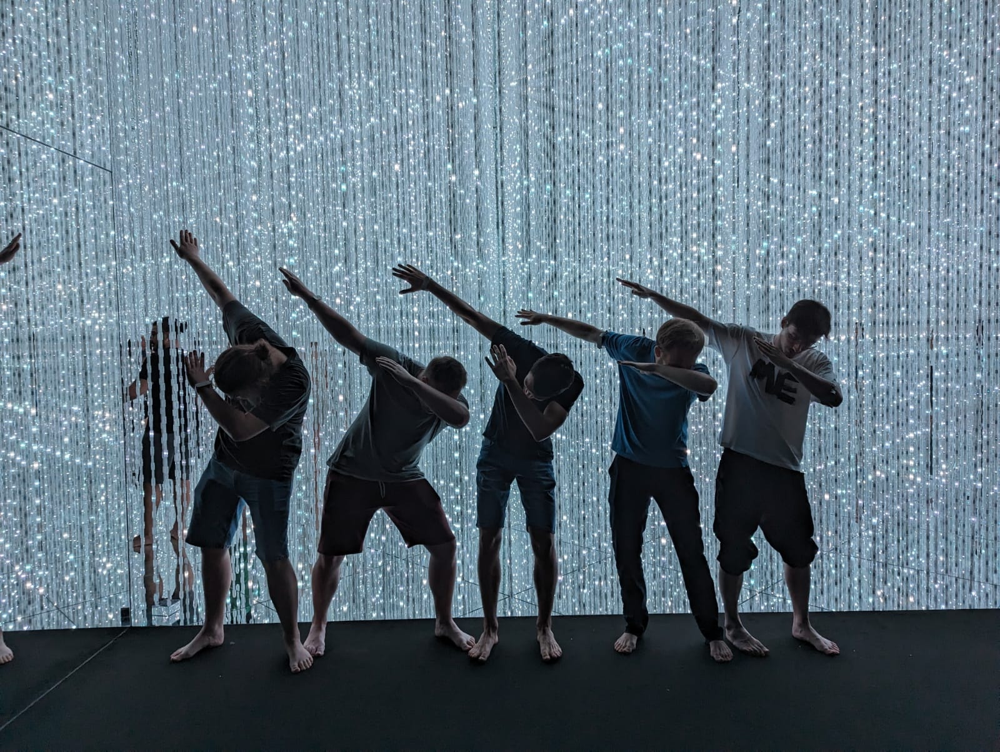
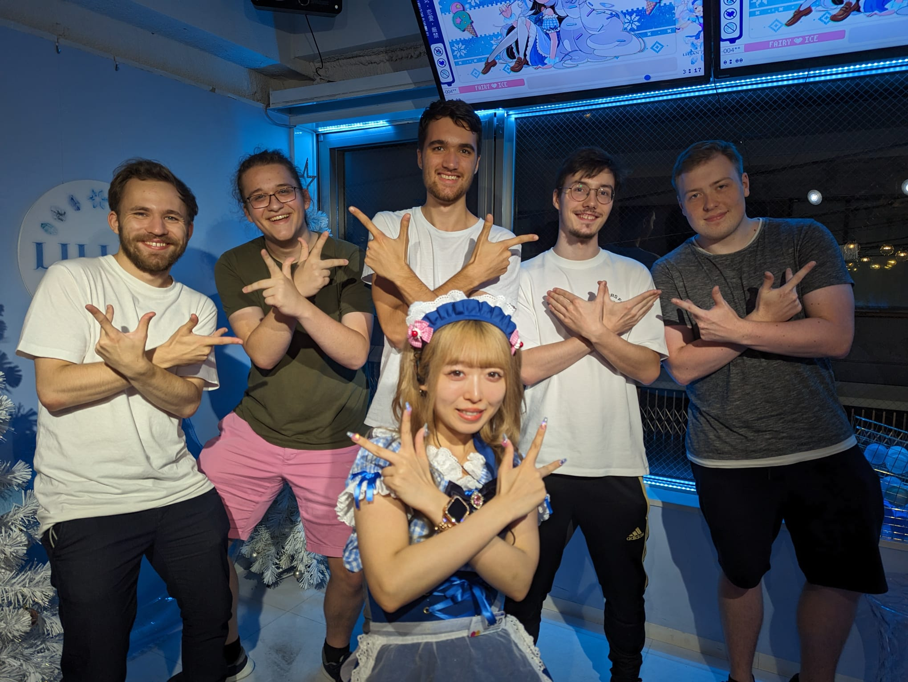

 # Sehenswertes
Als ich so drüber nachgedacht habe, ist mir aufgefallen, dass ich und die Bois eigentlich nicht wirklich viel "gemacht" haben. Die meiste Zeit sind wir einfach durch die Gegend gelaufen und haben radom Sachen und Dinge gemacht. Es gibt irgendwie immer was zu sehen und zu entdecken in dieser Stadt. Man läuft durch irgendein Hochhausviertel und zwischen zwei Gebäuden findet man auf einmal ein random Tori Gate und findet eine super nette Tempelanlage. Hier also nur ein paar Sachen, die irgendwie besonders im Kopf geblieben sind.

## teamLab Planets TOKYO
Einer der wenigen Dinge, die wir im Voraus geplant hatten. Das ist so ne interaktive Lichtshow/Museum. So n bisschen wie Himmel unter Berlin, aber schon n bisschen krasser. Egal, ob man Instafotos farmen will oder einfach ne geile Experience haben will, teamLab Planets war schon echt sehr worth it. Tickets muss man, glaube ich, auch etwas vorher buchen.

## Animal Cafés
Eine Sache für die Japan auch bekannt ist sind die Animal Cafés. Hier ist die Auswahl auch wieder grenzenlos. Von den klassischen Katzencafés hin zu Hausschwein- und Igelcafés gibt es gefühlt alles. Wir waren in so nem Igel-Café und es ist ja schon irgendwie putzig.  Man fragt sich dann auch immer n bisschen, wie witzig die kleinen Kollegen das dann immer finden, aber ich kann das auch nicht einschätzen. Drinks sind da meistens eher Mid, aber für n Stündchen kann man da schon mal machen.

## Maid Café
Maid Café ist schon ne Experience, sag ich. Die Maids selbst sind schon irgendwie funny, das Beste ist aber, wenn man in ner Gruppe ist, wo jemand das richtig cringe findet. Bei uns hatte Lars überhaupt keinen Bock und wir haben den die ganze Zeit mit ihr reden lassen. Wir hatten richtig fett unseren Spaß damit. Das Essen bei uns war ultra Mid, aber maybe gibt's auch Gutes. Am Ende des Tages hat es sich aber alleine für das Physiker Gang Bild gelohnt. Ich finde, sie passt perfekt in die Gang.

## Onsen
Ich weiß nicht ob du Saunas feierst, wenn ja ist ein Onsen Besuch auch schon ein Muss. Ich glaube, die öffentlichen Onsens sind immer geschlechtergetrennt, also not sure, ob das so das Play ist, aber ich glaube, es gibt auch so kleinere private Onsens. Müsst ihr euch mal umschauen. Wir waren auch in so 'nem fetten [Spa Onsen Ding](https://maps.app.goo.gl/y6bwWRX1bsvECq2a6). Das hat nach 15 Tagen Action auch schon echt gut getan, sag ich dir. Und im Winter jetzt knallt das, glaube ich, umso mehr.

## Einfach n bissn rumlaufen
Also viele von den anderen coolen Sachen und Orten sind halt in den anderen Kategorien. Ueno Market, Ueno Shrine, Nakano Broadway, schlendern durch Asakusa, Shimokitazawa Tour, Akihabara abchecken, etc. Am Ende des Tages würde ich mir auch nicht zu viel vornehmen und planen, sondern einfach mal n bissn rumlaufen und viben. Es gibt so viel zu sehen in Tokyo und ich hatte das Gefühl nicht mal an der Oberfläche zu kratzen von dem was es alles gibt. Durchs Rumlaufen entdeckt man genug interessante Orte und Dinge, die man ausprobieren will, und so ist es dann ja auch am besten.