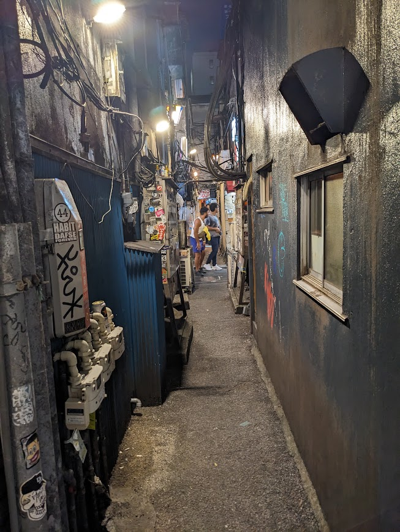
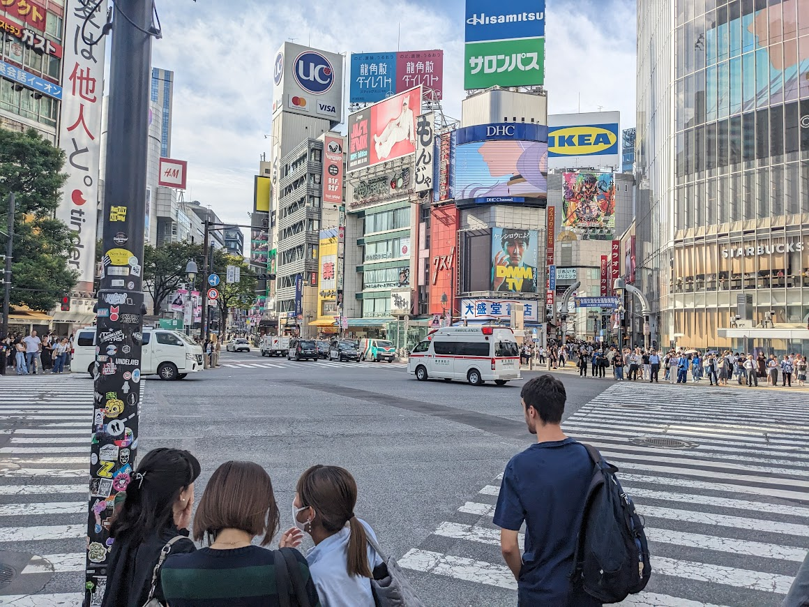
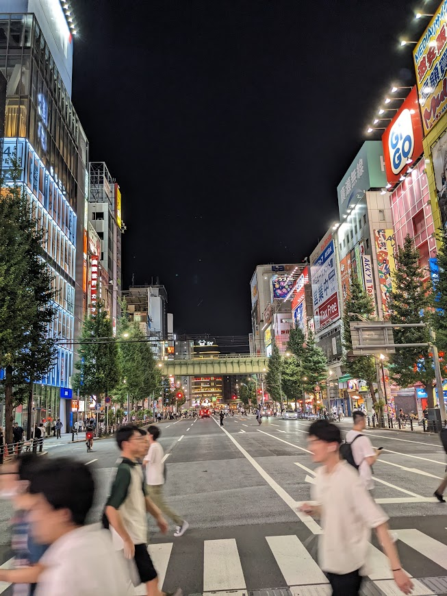
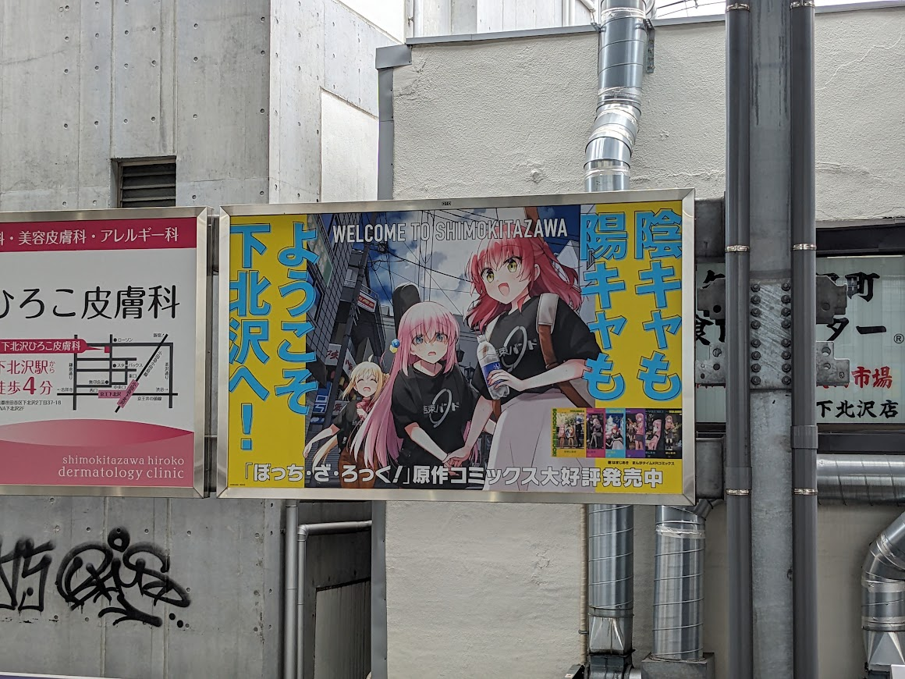
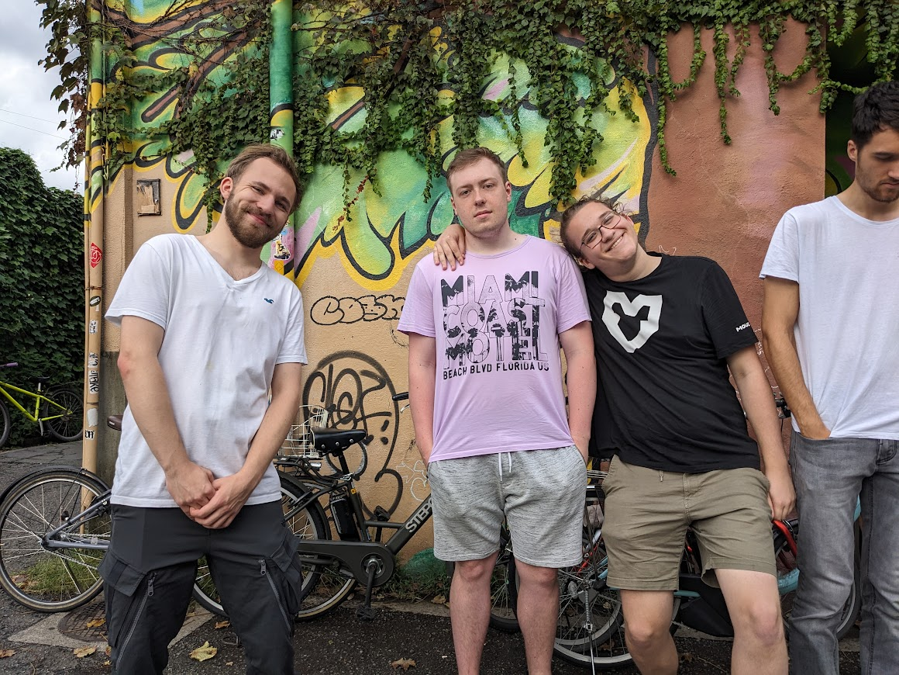
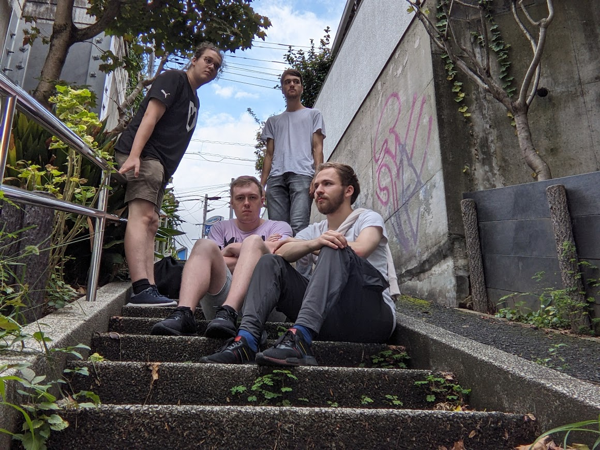
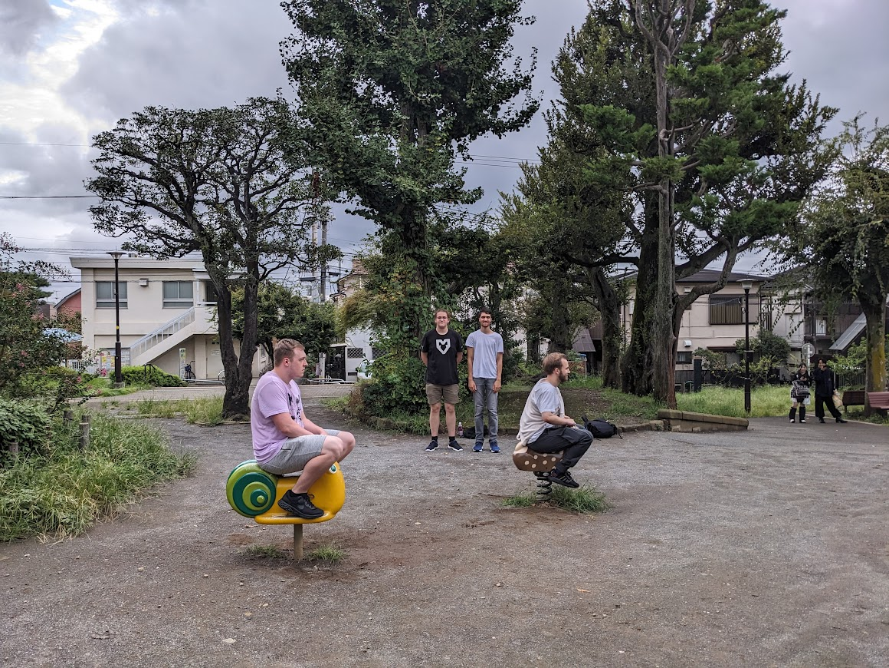
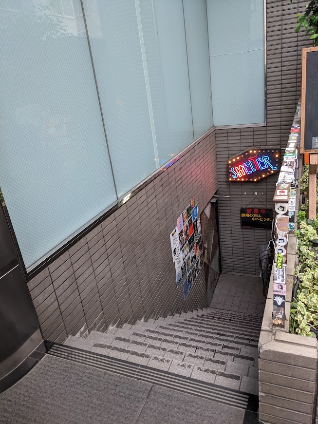

# Stadtteile
Wie so viele Großstädte hat auch Tokyo eine große Vielfalt an Stadtteilen, die alle ihren eigenen Charme mit sich bringen. Hier ein Paar, die wir aktiver mitbekommen haben.

## Shibuya & Shinjuku
Das sind wahrscheinlich die beiden bekanntesten Viertel und ich finde, beide haben einen sehr ähnlichen Vibe. Gute Mischung aus Shopping, Nachtleben, Entertainment und jungen Leuten. In Shinjuku gibt es auch die bekannte Golden Gai, die ein Labyrinth aus ganz vielen kleinen Gassen mit Bars ist. Die Bars sind auch sehr winzig, weswegen oft maximal 10 Leute reinpassen, aber alleine mal durchzulaufen lohnt sich. Wir hatten mit unserer 5er-Gruppe keinen Erfolg, aber eine Straße weiter gibt's eine Bar, in der wir auch einen richtig witzigen Abend hatten. Der Besitzer spricht auch gutes Englisch, also wenn ihr mal gepflegt einen heben wollt, kann ich [hier](https://maps.app.goo.gl/QrmT8fiec86J4wAT9) empfehlen.

## Asakusa
Asakusa ist das bekannteste Viertel, wenn es um Tradition und Kultur geht. Hier findet man viele alte und historische Gebäude. Leider haben wir es immer ’n bisschen vermasselt, die Museen auszusehnen, aber hier findest du z. B. das Nationalmuseum, das bestimmt einen Besuch wert ist. Es gibt auch so shopping Straßen wo du traditionelle Gegenstände und Essen kaufen kannst, das ganze wirkt aber immer sehr Touristisch, würde ich also eher von abraten. Diese Hauptrinne, die direkt zum Schrein führt, wirkte auf mich immer sehr nach Scam. Es gibt aber auch hier guten stuff, zum Beispiel den bomben Melon Pan Stand, der lohnt sich auf jeden Fall und es gab viele shops für die Matcha Baddies.

## Akihabara
Der Freak District. Hier ist das Paradies für alles, was Anime, Manga und Retro-Stuff angeht. Es gibt Dutzende Läden mit den niedrigsten Merch-Artikeln, die man sich ausdenken kann, über zig Stockwerke verteilt. Wir hatten hier eine unserer 4 Butzen und man kann mit Sicherheit gut mal nen Tag hier verbringen.

## Shimokitazawa
Einer der Tage, die mir am besten in Erinnerung geblieben ist, war unser Trip nach Shimokitazawa. Wir wollten unbedingt hierher, weil einer unserer Lieblingsanime hier spielt: Bocchi the Rock. Wenn du ihn noch nicht gesehen hast, umbedingt vor oder in Japan nachholen. 12 Folgen absolute Cinema. Es gibt sehr viele ikonische Locations, die man aus der Serie da wieder sehen kann. Ich und die Bois haben auch ’ne kleine Bocchi-Fotoserie gemacht. Hier ist eine [Map](https://www.google.com/maps/d/u/0/viewer?mid=13Y5dIrkTTCOC4w553tgFJjVjgoubso8&g_ep=CAISBjYuNTEuNhgAIN1iQgJTRw%3D%3D&g_st=ic&ll=35.66271314876967%2C139.66810572384514&z=18) mit Referenzbildern, falls ihr auch ein paar sehen wollt. Abgesehen davon hat Shimokitazawa mir aber auch generell extremst gut gefallen. Viele süße kleine Läden, viele Second Hand Shops, Cafés, Bars, etc. Generell hat es mehr so nen jungen alternativen Studenten-Vibe. Sehr empfehlenswert hier nen Tag zu verbringen. Hier gibt es auch ein [Café](https://maps.app.goo.gl/3NmYA2zdMrKv4MTm8), das ich unbedingt wollte, das aber an dem Tag schnell ausverkauft war (idk maybe kann man da reservieren oder so). Vielleicht habt ihr ja Glück.

